# Off-Grid Mobile AI - Architecture Overview

## System Architecture Diagram

```mermaid
graph TB
    subgraph DEVICE["On-Device (User's Phone)"]
        subgraph UI["UI Layer"]
            NAV["Navigation\nRootStack → MainTabs"]
            HOME["HomeScreen"]
            CHAT["ChatScreen"]
            MODELS["ModelsScreen"]
            SETTINGS["SettingsScreen"]
            CHATS["ChatsListScreen"]
            PROJ["ProjectsScreen"]
            LOCK["LockScreen"]
        end

        subgraph STATE["State Management (Zustand)"]
            AS["appStore\n(settings, device info)"]
            CS["chatStore\n(conversations, messages)"]
            AUTH_S["authStore\n(lock state)"]
            RS["remoteServerStore\n(server configs)"]
            DS["downloadStore\n(active downloads)"]
            PS["projectStore\n(user projects)"]
            WS["whisperStore\n(voice settings)"]
        end

        subgraph SERVICES["Services Layer"]
            LLM["llm.ts\n(local inference)"]
            GEN["generationService.ts\n(generation queue)"]
            TOOL["generationToolLoop.ts\n(tool execution)"]
            AUTH["authService.ts\n(passphrase hash/verify)"]
            RSMGR["remoteServerManager.ts\n(remote LLM clients)"]
            IMG["imageGenerationService.ts\n(local SD)"]
            WHIS["whisperService.ts\n(speech-to-text)"]
            RAG_SVC["RAG services\n(embedding, retrieval, chunking)"]
            DL["backgroundDownloadService.ts\n(model downloads)"]
            NET["networkDiscovery.ts\n(LAN server scan)"]
        end

        subgraph TOOLS["AI Tool Handlers"]
            SEARCH["web_search\n→ search.brave.com"]
            CALC["calculator"]
            DATE["get_current_datetime"]
            DEV["get_device_info"]
            KB_TOOL["search_knowledge_base"]
            READ_URL["read_url\n→ arbitrary URL"]
        end

        subgraph STORAGE["Persistent Storage"]
            ASYNC["AsyncStorage\n(chats, settings, servers,\nprojects, auth state)"]
            SQLITE["SQLite (op-sqlite)\n(RAG: documents,\nchunks, embeddings)"]
            FS["File System (react-native-fs)\n(model files, debug.log,\ndownloaded images)"]
            KC["Keychain (react-native-keychain)\n(passphrase hash,\nremote API keys)"]
        end

        subgraph NATIVE["Native Modules"]
            LLAMA["llama.rn\n(GGUF inference)"]
            WHIS_N["whisper.rn\n(on-device STT)"]
            DREAM["LocalDreamModule\n(Core ML / ONNX image gen)"]
            DL_N["DownloadManagerModule\n(Android background DL)"]
            PDF_N["PDFExtractorModule\n(PDF text extraction)"]
        end
    end

    subgraph EXTERNAL["External Services (Internet)"]
        HF["HuggingFace API\nhuggingface.co/api\n(model catalog, download URLs)"]
        BRAVE["Brave Search\nsearch.brave.com\n(web_search tool only)"]
        WED["wednesday.is\n(hire link, UTM tagged,\nuser-tap only)"]
        PRO["offgridmobileai.co\n(pro info page,\nuser-tap only)"]
        GH["github.com\n(share prompt link,\nuser-tap only)"]
    end

    subgraph LAN["Local Area Network (User's Wi-Fi)"]
        OLLAMA["Ollama Server"]
        LMSTUDIO["LM Studio Server"]
        OPENAI_C["OpenAI-Compatible\nRemote Server"]
    end

    %% UI → State
    CHAT --> CS
    HOME --> AS
    HOME --> CS
    MODELS --> DS
    SETTINGS --> AS
    CHATS --> CS
    PROJ --> PS
    LOCK --> AUTH_S

    %% UI → Services
    CHAT --> GEN
    MODELS --> DL
    SETTINGS --> AUTH

    %% Services → Storage
    LLM --> FS
    GEN --> CS
    AUTH --> KC
    RAG_SVC --> SQLITE
    DL --> ASYNC
    DL --> FS
    RSMGR --> KC
    RSMGR --> RS

    %% Services → Native
    LLM --> LLAMA
    WHIS --> WHIS_N
    IMG --> DREAM
    DL --> DL_N

    %% Generation pipeline
    GEN --> LLM
    GEN --> RSMGR
    GEN --> TOOL
    TOOL --> SEARCH
    TOOL --> CALC
    TOOL --> DATE
    TOOL --> DEV
    TOOL --> KB_TOOL
    TOOL --> READ_URL

    %% Local model inference (no network)
    LLAMA -.->|"all inference\nstays on device"| DEVICE

    %% External calls (internet)
    DL -->|"model file download"| HF
    MODELS -->|"model catalog fetch"| HF
    SEARCH -->|"user query\n(when tool is active)"| BRAVE
    HOME -->|"user taps link"| WED
    SETTINGS -->|"user taps link"| WED

    %% LAN calls (user-configured)
    RSMGR -->|"user-configured endpoint\nprivate network validated"| OLLAMA
    RSMGR -->|"user-configured endpoint"| LMSTUDIO
    RSMGR -->|"user-configured endpoint"| OPENAI_C

    %% LAN discovery
    NET -->|"mDNS / port scan"| OLLAMA
    NET -->|"mDNS / port scan"| LMSTUDIO

    style DEVICE fill:#0f2a1a,stroke:#34D399,color:#fff
    style EXTERNAL fill:#2a0f0f,stroke:#C75050,color:#fff
    style LAN fill:#0f1a2a,stroke:#3B82F6,color:#fff
    style UI fill:#1a1a1a,stroke:#34D399,color:#fff
    style STATE fill:#1a1a1a,stroke:#34D399,color:#fff
    style SERVICES fill:#1a1a1a,stroke:#34D399,color:#fff
    style TOOLS fill:#1a2a1a,stroke:#F59E0B,color:#fff
    style STORAGE fill:#1a1a1a,stroke:#34D399,color:#fff
    style NATIVE fill:#1a1a1a,stroke:#34D399,color:#fff
```



---

## Data Flow Summary

### What stays fully on-device
- All chat messages and conversation history
- All AI inference (llama.rn, whisper.rn, Core ML)
- User projects and knowledge base (RAG)
- App settings and passphrase
- Generated images
- Debug logs

### What goes to HuggingFace (expected)
- Model catalog searches (no user data, just search queries like "llama 3B gguf")
- Model file downloads (binary model files only)

### What goes to Brave Search (user opt-in tool)
- User search queries - only when the AI uses the `web_search` tool during a conversation

### What goes to user-configured LAN servers
- Chat messages and context - only when user explicitly adds a remote server

### What the user opens in browser (user-tap only)
- `mobile.wednesday.is` (hire link, with UTM params)
- `offgridmobileai.co` (pro info page)
- `github.com/alichherawalla/off-grid-mobile-ai` (share prompt)
- Twitter/X (share prompt)

---

## Security Findings

### Clean
- No analytics or telemetry SDKs (no Firebase, Sentry, Amplitude, Mixpanel, Datadog)
- No background data exfiltration
- API keys for remote servers stored in OS Keychain, not AsyncStorage
- No hardcoded secrets or API keys in the codebase
- No .env files with credentials

### Issues Found

#### 1. Weak Passphrase Hashing (Medium)
**File:** `src/services/authService.ts:12`

The app lock passphrase is hashed with a custom 32-bit rolling hash + 1000 iterations. This is not a proper key derivation function. A 32-bit output means only ~4 billion possible hash values regardless of passphrase length, making brute-force trivial on extracted keychain data.

**Fix:** Replace with a proper KDF - use `react-native-argon2` or `react-native-quick-crypto` with PBKDF2.

#### 2. Private Network Validation is Advisory Only (Low)
**File:** `src/components/RemoteServerModal/useRemoteServerForm.ts:121`

`isPrivateNetworkEndpoint()` is only checked for a UI warning, not to block requests. A user can dismiss the warning and connect remote servers to public internet endpoints. The HTTP client (`httpClient.ts`) makes no validation.

**Impact:** If a user (or an attacker with physical access) configures a public endpoint, chat messages would be sent to that endpoint. The design intent says LAN-only but code doesn't enforce it.

**Fix:** Enforce `isPrivateNetworkEndpoint()` inside `createStreamingRequest()` or in the provider layer before sending chat data.

#### 3. `read_url` Tool Has No Domain Allowlist (Low)
**File:** `src/services/tools/handlers.ts:350`

The `read_url` AI tool can fetch any `http://` or `https://` URL. There is no allowlist or content-type restriction. The AI could theoretically be prompted to read internal metadata URLs or exfiltrate data to a URL.

**Fix:** Add a domain allowlist or restrict to `https://` only, and validate the response content-type to HTML/text.

#### 4. `web_search` Sends Queries to Brave (Informational)
**File:** `src/services/tools/handlers.ts:58`

When the `web_search` tool is active in a conversation, user search queries are sent to `search.brave.com`. This is expected behavior for a web search tool, but should be clearly disclosed in the tool description shown to the user.

**Impact:** Low - this is intentional functionality. Brave's privacy policy applies. No user identity is sent.
```
